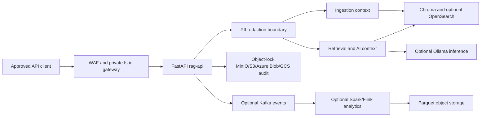

# Architecture and operations guide

## Scope and current status

Hybrid Streaming RAG is a reference implementation for regulated document and
transaction workflows. It accepts documents and questions through one FastAPI
process, redacts recognized PII, retrieves sanitized evidence, and optionally
integrates with Kafka, Chroma, OpenSearch, Ollama, and object-locked S3/MinIO
Azure Blob, or GCS audit storage.

The bounded contexts are logical modules in one deployed service; they are not
independently deployed microservices. The local profile and tests demonstrate
behavior, not a production deployment, PCI attestation, cloud execution,
throughput target, RTO/RPO, or compliance certification. Production ownership
must establish those outcomes and retain the evidence.

## Architecture at a glance



| Area | Implemented responsibility | Main source locations |
| --- | --- | --- |
| HTTP boundary | FastAPI routes, tracing headers, health, metrics | `app/main.py`, `app/health.py`, `app/metrics.py` |
| Privacy | Versioned, canonicalized 128-bit HMAC tokenization and boundary guard | `app/redaction.py` |
| Ingestion | Sanitized chunk creation and telemetry events | `contexts/ingestion/` |
| Retrieval | Store lookup, optional model call, bounded resilience | `contexts/ai/` |
| Governance | Kafka publication and audit records | `contexts/governance/`, `app/audit.py` |
| Payments | Tokenized event intake and deterministic risk baseline | `contexts/payments/` |
| Contracts | Immutable domain events and value objects | `domain/` |
| Deployment | Container, Helm, Kubernetes, Ansible, Terraform | `Dockerfile`, `rag-chart/`, `ansible/deploy-rag.yaml`, `terraform/` |

### Data and event contracts

The RAG HTTP ingress is the only component allowed to hold raw client content
or identifiers. It redacts recognised PII before it reaches chunking,
embeddings, retrieval, model inference, metadata indexing, events, or audit
storage. Source labels and payment transaction/merchant identifiers are
canonicalized HMAC tokens before their metadata/events leave the ingress
service. Tokens are versioned 128-bit HMAC-SHA-256 truncations; recognised PII
forms (for example email case and formatted card/phone/SSN digits) canonicalize
to the same token, enabling deterministic search and retrieval without storing
the raw value.

`PII_TOKEN_SALT` is a secret-manager value and must be unique per approved
search domain. Rotate it only with a reviewed re-tokenization/re-indexing plan;
changing the key or token format invalidates prior deterministic matches. HMAC
tokens are defense in depth, not a substitute for data classification, DLP,
authorization, PCI segmentation, or an independent GDPR/PCI compliance
assessment.

Events are frozen dataclasses in `domain/events.py`. Each includes immutable
`event_id`, `correlation_id`, `causation_id`, and a server-issued
`traceparent`. Kafka publication is optional (`ENABLE_KAFKA=true`) and emits
safe metadata as UTF-8 headers. The publisher fails closed if its final
sanitization guard would change an event payload or custom header, preventing
an unreviewed producer from transmitting recognised PII or an untokenized
sensitive field.

| Event | Topic | Role |
| --- | --- | --- |
| `TelemetryIngested` | `telemetry.ingested` | Sanitized document/chunk lifecycle |
| `TransactionProcessed` | `transaction.processed` | Generic transaction integration |
| `AuditRecordLogged` | `audit.record.logged` | Successful audit record location |
| `StateTransitionLogged` | `state.transition.logged` | Lifecycle state evidence |
| `IngestionCompensated` | `ingestion.compensated` | Ingestion side-effect failure |
| `TransactionCompensated` | `transaction.compensated` | Retrieval/audit compensation |
| `PaymentTransactionIngested` | `payments.transaction.ingested.v2` | Token-only payment intake |
| `PaymentRiskScored` | `payments.risk.scored.v2` | Token-only risk decision |
| `PaymentCompensated` | `payments.compensated.v2` | Fail-closed payment risk handling |

Treat event names, topic names, and field meanings as integration contracts.
Prefer additive fields. Changing a meaning, removing/renaming a field, or
changing a topic requires a consumer migration and compatibility plan. The
current publisher produces JSON; it is not a Registry-validated Avro outbox and
does not prove durable exactly-once delivery. The registered v2 Avro artifacts
match the tokenized payment event fields and are a separate producer/consumer
contract; register them before enabling a schema-enforced payment pipeline.

## Key architecture decisions

### Resilience, correlation, and audit

Every request gets server-issued request and correlation IDs plus a W3C
`traceparent`; caller-supplied tracing headers are discarded rather than
persisted as provenance. On a
successful side-effecting flow, the audit lifecycle is
`INITIALIZED → PROCESSING → COMPLETED`; a recoverable/failed path records
`INITIALIZED → PROCESSING → COMPENSATED` and a compensating event. The service
uses bounded bulkhead, token-bucket, and timeout policies for retrieval/model
calls, keeping error classes—not raw dependency errors or payloads—in safe
observability records.

`ENABLE_AUDIT_STORE=true` writes canonical JSON containing only server-issued
correlation identifiers, HMAC tokens, and operational metadata to a pre-created
S3-compatible bucket using Object Lock, an Azure Blob container using a locked
immutability policy, or a GCS bucket using irreversible Bucket Lock.
`AUDIT_BACKEND=s3|azure_blob|gcs`, retention, object
encryption, bucket/container policy, read permissions, and restore tests are
operator responsibilities. The in-process fallback is bounded and exists only
for development and tests.

Kafka producer creation is single-flight and connection failures are deferred
for `KAFKA_RECONNECT_BACKOFF_SECONDS` (30 seconds by default), so an outage
does not make every request reconnect. It publishes with `acks=all`; payment
events use their HMAC `transaction_token` as the Kafka key to retain per-payment
partition order without exposing a raw identifier.

An audit failure after indexing triggers a best-effort removal of the newly
created vector/search chunk IDs before recording compensation. This is a
bounded compensating transaction, not event-sourcing-based rollback:
compensation cannot undo a Kafka send or another already-committed remote side
effect. A durable event-sourcing design additionally needs an append-only event
store, transactional outbox, idempotent projectors, replay authorization, and
tested restore. Python cannot forcibly stop an uncooperative timed-out worker,
so production adapters must also use
transport-level timeouts and workloads should be separated where hard isolation
is required.

### Security and identity

Use private networks for Kafka, object storage, search, vector storage, and
model services. Secrets, certificates, salt values, and Terraform state must
never enter Git. The deployment includes `rag-api`-scoped default-deny
Kubernetes NetworkPolicy; the allow policy permits only Istio ingress,
Prometheus' merged metrics port, configured in-namespace dependencies, istiod
xDS, and CoreDNS as needed. Cloud overlays additionally permit HTTPS to
configured storage/identity endpoints. Standard Kubernetes NetworkPolicy has
no FQDN rule: replace each overlay's broad HTTPS CIDR with an approved private
endpoint or egress-gateway CIDR before production. The GKE profile explicitly
allows the documented Workload Identity metadata-server paths.

The mesh deployment sequence installs SPIRE CRDs, the pinned hardened SPIRE
chart (server, agent, Controller Manager, CSI driver, and OIDC discovery
provider), then Istio base, control plane, and gateway. The Controller Manager
reconciles one selected `rag-api` `ClusterSPIFFEID`; the CSI driver bind-mounts
the directory containing the Workload API Unix socket at
`/run/spiffe/workload`. When SPIFFE is enabled, readiness opens the local
`SPIFFE_ENDPOINT_SOCKET`; it does not expect or read projected SVID files.
Istio runs in sidecar mode and
independently enforces STRICT mTLS. SPIRE application identity is not a
replacement for istiod's Envoy certificate path, and Ambient mode is out of
scope for this integration.

The application itself does not implement end-user authentication or
authorization. The environment must provide TLS termination, identity-aware
WAF/gateway policy, authorization, CDE/data classification, access reviews,
and evidence appropriate to its regulatory obligations.

### Deployment topology and portability

The workload contract is portable across on-premises, AWS, Azure, GKE, and other
conformant Kubernetes clusters. Environment differences are limited to the
Kubernetes client, durable storage class, private edge route, DNS, and approved
SPIFFE trust-domain configuration; they must not change the API, event, audit,
or `rag-api` identity contract.

| Target | Entry point | Edge route | Required prerequisite |
| --- | --- | --- | --- |
| On-premises (primary) | `playbook.yaml`, `configure-mesh.yaml`, then `deploy-rag.yaml` | Organization WAF → private Istio gateway → `rag-api` | New kubeadm/containerd nodes, HA design for production, reviewed CSI StorageClass |
| AWS EKS | `configure-mesh.yaml`, then `deploy-rag.yaml` from a bastion/CI runner | AWS WAF/equivalent → private Istio gateway | Prepared private cluster, kubeconfig, storage, WAF/LB routing, IRSA role |
| Azure AKS | `configure-mesh.yaml`, then `deploy-rag.yaml` from a bastion/CI runner | Azure WAF/equivalent → private Istio gateway | Prepared private cluster, kubeconfig, storage, WAF/LB routing, immutable Blob container |
| Google GKE | `configure-mesh.yaml`, then `deploy-rag.yaml` from a bastion/CI runner | Cloud Armor/equivalent → private Istio gateway | Prepared private cluster, kubeconfig, GKE Workload Identity, GCS Bucket Lock audit bucket |
| Other Kubernetes | `configure-mesh.yaml`, then `deploy-rag.yaml` | Organization WAF → private Istio gateway | Conformant cluster and reviewed platform inputs |
| K3s lab/edge (legacy) | `ansible/provision.yaml` | Traefik/Coraza → private Istio gateway | Lab-only local-path storage; not the production default |

`playbook.yaml` installs the primary on-premises stack on new Debian/Ubuntu
nodes: containerd, Kubernetes 1.35 (`kubeadm`, `kubelet`, `kubectl`), and pinned
Calico 3.32.2. It refuses nodes with existing K3s or kubeadm state; it is not an
in-place conversion procedure. The supplied topology has one control plane for
lab use. Production needs an approved HA control-plane endpoint, durable CSI
storage, capacity planning, backups, and a tested recovery design before the
mesh is enabled.

The kubeadm distribution has no dynamic StorageClass. For an approved
local-disk on-prem target only, enable the optional pinned Rancher Local Path
provisioner with `-e install_local_path_provisioner=true`, then configure the
mesh with `storage_class=local-path`. It is pinned to `v0.0.36` in
`ansible/kubernetes-vars.yaml` and is not a replacement for replicated
production CSI storage.

Terraform's AWS/Azure/GCP starters provide audit/search-related inputs. They do
not create a complete VPC/VNet, private endpoint/PrivateLink, EKS/AKS/GKE
cluster, public ingress, or provider WAF. Use organization-reviewed platform
modules and least-privilege identities for those resources.

## Deploy and operate

### Prepare a target cluster

Before enabling SPIFFE/SPIRE manifests, ensure the target has a functioning
Kubernetes control plane, Helm access, installation permission, durable
StorageClass, DNS, private WAF-to-gateway route, and approved values for:

- a unique, lowercase `spire_trust_domain` and `spire_cluster_name`;
- CA subject and JWT issuer;
- actual `mesh_ingress_host` and storage class; and
- cloud/on-prem identity, WAF, private networking, and audit-retention policy;
- a private gateway route: cloud-native `LoadBalancer`, or on-prem
  `mesh_gateway_service_type=LoadBalancer`, `metallb_enabled=true`, and an
  explicitly approved `metallb_address_pool` when MetalLB is selected.

Never use an example trust domain for a production cluster or reuse a lab trust
domain in production. Deploy `rag-api` only through the Helm chart after mesh
preparation; raw `rag-api`/service-mesh manifests were removed to prevent drift.

For new on-premises infrastructure, first bootstrap then configure the mesh:

```bash
ansible-playbook -i inventory.ini playbook.yaml
ansible-playbook -i inventory.ini ansible/configure-mesh.yaml -e deployment_profile=onprem -e kubeconfig=/etc/kubernetes/admin.conf -e storage_class=your-csi-storage-class -e spire_trust_domain=prod.example -e spire_cluster_name=prod-onprem-01 -e spire_jwt_issuer=https://oidc-discovery.prod.example -e mesh_ingress_host=rag.prod.example
ansible-playbook -i inventory.ini ansible/deploy-rag.yaml -e deployment_profile=onprem -e kubeconfig=/etc/kubernetes/admin.conf -e rag_image=registry.example/rag-api -e rag_image_tag=immutable-image-sha
```

For a prepared cloud/other target, place a configured controller in
`mesh_controller` and use its secure kubeconfig; change only the profile and
approved platform values:

```bash
ansible-playbook -i cloud-inventory.ini ansible/configure-mesh.yaml -e deployment_profile=aws -e kubeconfig=/secure/path/cluster.kubeconfig -e storage_class=gp3 -e spire_trust_domain=prod.example -e spire_cluster_name=prod-eks-01 -e spire_jwt_issuer=https://oidc-discovery.prod.example -e mesh_ingress_host=rag.prod.example
ansible-playbook -i cloud-inventory.ini ansible/deploy-rag.yaml -e deployment_profile=aws -e kubeconfig=/secure/path/cluster.kubeconfig -e rag_image=registry.example/rag-api -e rag_image_tag=immutable-image-sha
```

Use `deployment_profile=azure` and an approved AKS storage class for Azure, or
`deployment_profile=gcp` and the approved GKE CSI storage class for GKE. GKE
also requires an approved Workload Identity principal with only GCS
`objectCreator` and bucket-metadata read access, plus a locked GCS bucket named
by `terraform/gcp`. The legacy K3s provisioning play must not be run against
managed Kubernetes.

For GKE, create the GCS Bucket Lock contract first, bind the reviewed GKE
Workload Identity principal, then provide its non-secret identity values to the
Helm-only deployment play. The default Terraform binding targets the standard
`PROJECT_ID.svc.id.goog` identity pool; set `gke_workload_identity_pool` when
the prepared cluster uses an approved non-default pool. The play generates a
controller-local values overlay for the Kubernetes service-account annotation
and GCS runtime configuration; it never mounts a Google credential file.

```bash
terraform -chdir=terraform/gcp init
terraform -chdir=terraform/gcp apply -var project_id=your-gcp-project -var spire_trust_domain=prod.example -var spire_cluster_name=prod-gke-01 -var mesh_ingress_host=rag.prod.example
ansible-playbook -i cloud-inventory.ini ansible/configure-mesh.yaml -e deployment_profile=gcp -e kubeconfig=/secure/path/gke.kubeconfig -e storage_class=standard-rwo -e spire_trust_domain=prod.example -e spire_cluster_name=prod-gke-01 -e spire_jwt_issuer=https://oidc-discovery.prod.example -e mesh_ingress_host=rag.prod.example
ansible-playbook -i cloud-inventory.ini ansible/deploy-rag.yaml -e deployment_profile=gcp -e kubeconfig=/secure/path/gke.kubeconfig -e rag_image=registry.example/rag-api -e rag_image_tag=immutable-image-sha -e gcp_project_id=your-gcp-project -e gcp_audit_bucket=hybrid-rag-audit-your-gcp-project -e gcp_workload_identity_service_account=rag-audit@your-gcp-project.iam.gserviceaccount.com
```

Before admitting traffic, prove all of the following:

1. `kubectl get csidriver csi.spiffe.io` and
   `kubectl get clusterspiffeid rag-api` succeed and resolve to the intended
   trust domain.
2. A `rag-api` pod has both `istio-proxy` and the `spiffe-workload-api` volume,
   and `/health/ready` reports `spiffe_workload_api` as `ok`.
3. `PeerAuthentication/rag-api-strict-mtls` is STRICT and plaintext direct
   traffic is rejected.
4. The WAF can reach only the Istio gateway, never `rag-api` directly.
5. Changes to the workload namespace, service account, or stable labels receive
   identity/security review because they change SPIRE registration selectors.

### Delivery, monitoring, and recovery

Pull requests run Python 3.12/3.13 pytest, Ansible/YAML lint and syntax checks,
Helm rendering/schema checks, a kubeadm config dry-run, Docker build, and Trivy
image/IaC HIGH/CRITICAL gates. Publishing occurs only for a version tag or explicit dispatch with
protected secrets. A deployment requires a protected environment and
`KUBE_CONFIG`; it must use an immutable image tag and the Helm chart. Jenkins
provides equivalent opt-in publish controls. Argo CD renders `rag-chart/` rather
than a second raw manifest source; promotion still requires reviewed image
values, canary thresholds, and rollback criteria.

Use `/health/live` or `/healthz` only for liveness, and `/health/ready`,
`/readyz`, and `/health/startup` for dependency-aware probes. Scrape `/metrics`
internally. Monitor Kafka lag, streaming checkpoints/savepoints, object-store
errors, search health, model availability, PVC capacity, and rejected/readiness
probes using the host observability platform.

`k8s/velero-backup.yaml` defines a daily encrypted S3/MinIO-targeted Velero
schedule with CSI snapshots and a filesystem-backup fallback;
`k8s/velero-backup-azure.example.yaml` is the deliberately non-default AKS
Azure Blob profile. GKE requires the matching Velero GCP plugin, an encrypted
GCS backup store, and a GCE persistent-disk snapshot provider. Install the
matching plugin and snapshot provider, create the credentials/identity and
encrypted backup store, then test isolated
restores at least quarterly. Preserve audit retention; rebuild Chroma from
sanitized source data where necessary; validate event schema compatibility
before Kafka replay; and prove recovery of OpenSearch, TimescaleDB/EventStoreDB
volumes, and MirrorMaker as applicable. Do not delete an audit bucket or
container to repair a lab.

## Verification and production acceptance

Run the baseline checks before review:

```bash
python -m pytest -q --junitxml=test-results/pytest.xml
python -m ops.smoke_test
```

The local suite validates unit/API/redaction/payment/health behavior, adapter
imports, bounded resilience, correlation propagation, compensation, and
deterministic chaos cases. It does not validate a cloud cluster, provider WAF,
external identity system, live SVID rotation, mTLS traffic, disaster recovery,
load, fraud-model quality, PCI scope, or security-vulnerability absence.

Before production payment or regulated-data use, owners must additionally
validate private network architecture; authentication/authorization and CDE
segmentation; schema compatibility, durable outbox/idempotency, and replay;
model governance, drift, precision/recall, prompt-injection, and human review;
backup restoration and RTO/RPO; certificate/SVID rotation; denied ingress and
egress; WAF policy; container/IaC scans; and independent compliance assessment.
Documentation and manifests are implementation evidence, not certification.
