# TOGAF Architecture Definition

This document applies the TOGAF Architecture Development Method (ADM) to the
implemented omni-stream-RAG-mesh reference platform. It is an architecture
definition and transition guide, not a claim that every enterprise control is
already provisioned. Optional integrations are called out explicitly.

## Phase A — Architecture vision

### Business drivers

- Produce explainable, immutable evidence for financial compliance reviews.
- Redact/tokenize sensitive data before vector embedding or model inference.
- Correlate transaction and IoT telemetry streams with low operational latency.
- Preserve deployment portability across local Docker, kubeadm Kubernetes,
  managed AWS/Azure Kubernetes, and the legacy K3s edge/lab profile using
  environment-driven adapters and S3-compatible storage.
- Provide auditable delivery gates and repeatable infrastructure provisioning.

### Stakeholders

| Stakeholder | Concern | Architecture response |
| --- | --- | --- |
| Financial analyst/compliance officer | Evidence, lineage, retention | Object-lock audit records and searchable metadata |
| IoT operator/site owner | Telemetry freshness and anomalies | Kafka topics and windowed Spark processing |
| Data protection officer | PII minimization and residency | Redaction boundary, token salt, private data paths |
| Platform/SRE team | Availability, scaling, recovery | Stateless API, probes, PVCs, checkpoints, snapshots |
| Security engineering | Zero trust and supply chain | NetworkPolicy, mTLS hooks, external secrets, Trivy gates |
| Delivery/product owner | Incremental adoption | Drop-in adapters and phased migration roadmap |

### Scope and vision

In scope are the FastAPI service, DDD application domains, Kafka event
contracts, ChromaDB/Ollama retrieval, OpenSearch/Elasticsearch metadata,
MinIO/S3 audit and lakehouse storage, Spark streaming, and deployment
scaffolding in `docker-compose.yml`, `k8s/`, `terraform/`, `ansible/`, and
`deploy/`. Authentication, enterprise IAM, managed Kafka, and production
observability are integration responsibilities rather than bundled behavior.

```archimate
Business Actor "Financial Analyst" as analyst
Business Actor "IoT Operator" as operator
Business Service "Compliance evidence and telemetry intelligence" as service
Business Process "Sanitize, retrieve, explain, and audit" as process
Business Object "Protected financial and telemetry data" as data
analyst --> service
operator --> service
service --> process
process --> data
```

### Phase A equivalent views

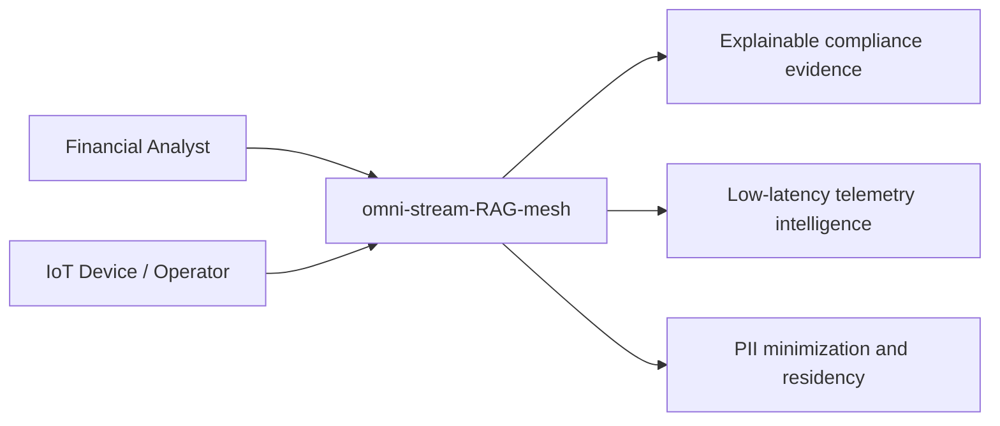

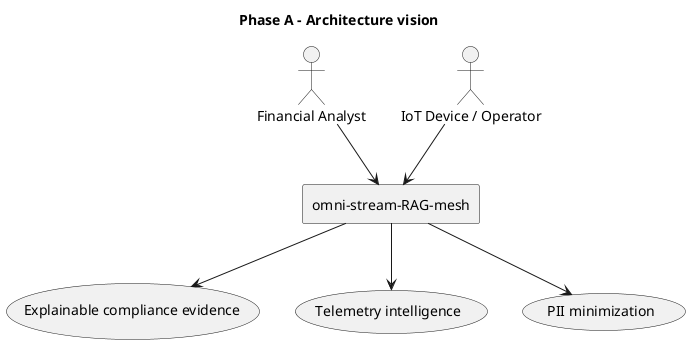

## Phase B — Business architecture

### Value streams

1. **Financial compliance audit:** ingest transaction evidence → classify and
   tokenize PII → index sanitized evidence → retrieve supporting context →
   produce an answer → immutably retain prompt, evidence, and output.
2. **IoT telemetry intelligence:** receive telemetry → publish domain event →
   window and aggregate stream → write Parquet to object storage → expose
   indexed context for investigation.
3. **Controlled platform change:** review code/IaC → test and scan → publish
   artifact → synchronize deployment → observe and recover.

### Actors and use cases

| Actor | Use case | Current repository surface |
| --- | --- | --- |
| Financial analyst | Submit evidence and ask an evidence-grounded question | `POST /ingest-sample`, `POST /ask` |
| Compliance officer | Retrieve retained audit evidence | Object-store and optional metadata-index access |
| IoT device/operator | Publish telemetry events | Kafka integration/event topics |
| Data engineer | Operate stream processing | `streaming/spark_job.py` |
| Platform engineer | Deploy and upgrade platform | Compose, Kubernetes, Terraform, Ansible, ArgoCD |

```archimate
Business Actor "Financial Analyst" as fa
Business Actor "IoT Device / Operator" as iot
Business Service "Financial compliance audit" as audit
Business Service "IoT telemetry monitoring" as telemetry
Business Process "PII-aware RAG investigation" as investigation
Business Process "Windowed telemetry processing" as windows
fa --> audit
iot --> telemetry
audit --> investigation
telemetry --> windows
```

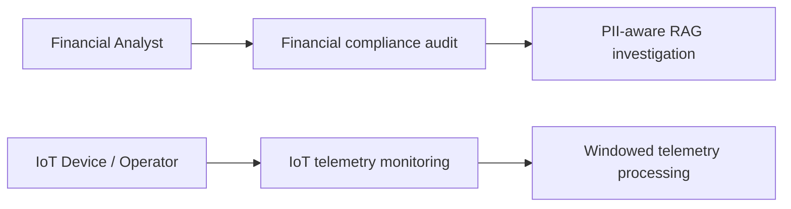

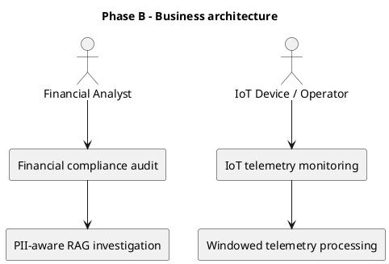

## Phase C — Information systems architecture

### Application architecture

The FastAPI application is organized around the ingestion, AI/retrieval, and
governance bounded contexts under `contexts/`, with shared entities, value
objects, and events under `domain/`. `app/main.py` composes these services and
adapters.

### Data architecture

- **MinIO/S3:** immutable JSON audit objects and Spark Parquet output.
- **ChromaDB:** optional vector collection populated with sanitized chunks and
  Ollama embeddings.
- **OpenSearch:** current Compose search adapter for text retrieval.
- **Elasticsearch:** optional metadata/audit index adapter in `app/metadata.py`.
- **Kafka:** event transport for `telemetry.ingested`,
  `transaction.processed`, and `audit.record.logged`.
- **Spark:** common event envelope parsing, ten-minute watermark, one-minute
  windows, and append-mode Parquet output.

```archimate
Application Component "FastAPI DDD service" as api
Application Component "Ingestion context" as ingestion
Application Component "AI / Retrieval context" as ai
Application Component "Governance context" as governance
Application Component "Kafka publisher" as publisher
Data Object "Sanitized chunks and embeddings" as vectors
Data Object "Immutable audit JSON" as audits
Data Object "Windowed telemetry Parquet" as parquet
api --> ingestion
api --> ai
api --> governance
ingestion --> publisher
ai --> vectors
governance --> audits
publisher --> parquet
```

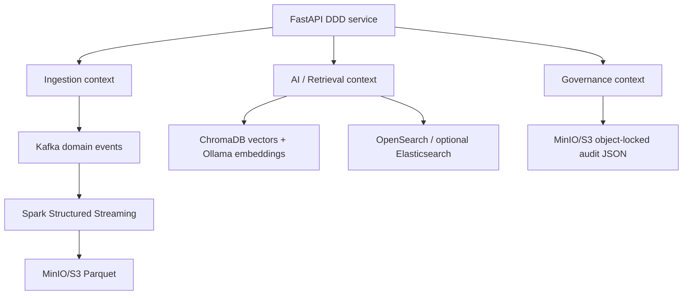

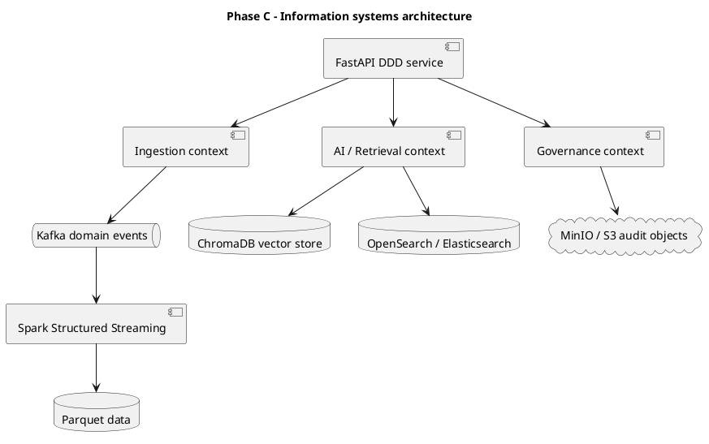

## Phase D — Technology architecture

The technology baseline is container-first and platform-agnostic:

- Docker Compose provides the local reference topology.
- Kubernetes manifests target a `rag` namespace; they are compatible with
  kubeadm Kubernetes when its CSI storage, ingress, and policy choices are
  supplied; K3s is retained only for constrained lab/edge use.
- Kafka is configured in KRaft mode; production deployments should use
  multiple brokers and replication.
- Spark is the implemented streaming engine; `streaming/flink-job.yaml` is an
  additional Flink deployment extension point.
- Terraform provides small AWS/Azure provider starting points.
- Ansible prepares hybrid hosts and optional NVIDIA tooling.
- ArgoCD and Argo Rollouts provide GitOps/progressive-delivery scaffolding.
- Jenkins gates image and IaC changes with Trivy HIGH/CRITICAL scans.
- cert-manager and NetworkPolicy provide mTLS/zero-trust integration hooks;
  identity, ingress authentication, and external secrets must be supplied by
  the target enterprise.

```archimate
System Software "kubeadm Kubernetes / managed Kubernetes" as k8s
System Software "Docker runtime" as docker
System Software "Kafka KRaft" as kafka
System Software "Spark Structured Streaming" as spark
System Software "MinIO / S3" as object
System Software "ChromaDB + Ollama" as rag
System Software "OpenSearch / Elasticsearch" as search
Technology Service "mTLS and zero-trust network controls" as trust
docker --> k8s
k8s --> kafka
k8s --> spark
k8s --> object
k8s --> rag
k8s --> search
k8s --> trust
```

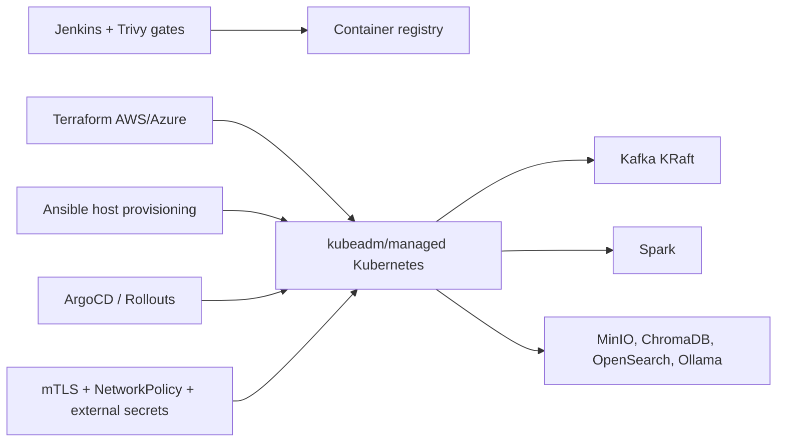

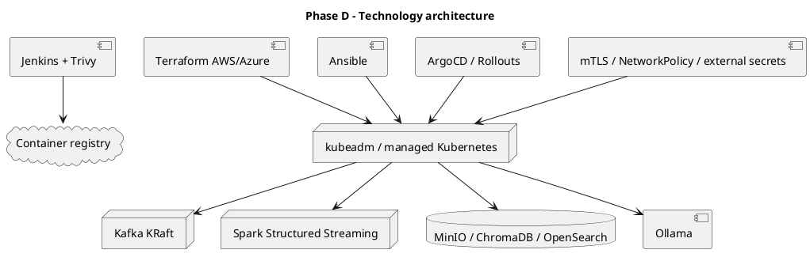

## Phase E — Opportunities and solutions

### Migration roadmap

| Phase | Outcome | Entry/exit criteria |
| --- | --- | --- |
| 0. Baseline | Local Compose proof of flow | Tests pass; secrets externalized |
| 1. Govern | Object lock, PII policy, IAM, TLS | Retention and access evidence reviewed |
| 2. Stream | Kafka replication and Spark checkpoints | Replay and lag drills pass |
| 3. Scale | kubeadm/managed Kubernetes replicas and managed storage | Load, failover, and restore objectives met |
| 4. Integrate | Enterprise brokers, IAM, SIEM, CMDB, data catalog | Contract and ownership sign-off |
| 5. Optimize | Model evaluation, cost controls, canary releases | Quality and SLO dashboards accepted |

### Drop-in enterprise integration patterns

- Replace the Kafka bootstrap endpoint with managed Kafka or an enterprise
  broker while retaining the event/topic contract.
- Replace MinIO with AWS S3 or an S3-compatible gateway while preserving
  object-lock semantics and `s3a://` paths.
- Point `SEARCH_URL`/`ELASTICSEARCH_URL` at managed search and retain
  create-only audit metadata writes.
- Replace Ollama with a governed model gateway behind the same retrieval
  service boundary; preserve sanitized prompt inputs and audit metadata.
- Inject secrets through Vault, cloud secret managers, or External Secrets;
  do not change application code to embed credentials.
- Add OpenTelemetry/metrics exporters at the platform boundary without
  coupling domain services to a specific observability vendor.

```archimate
Plateau "Reference platform" as baseline
Plateau "Governed enterprise platform" as target
WorkPackage "Externalize secrets and identity" as identity
WorkPackage "Replicate Kafka and object storage" as scale
WorkPackage "Integrate SIEM, catalog, and model gateway" as integrate
baseline --> identity
identity --> scale
scale --> integrate
integrate --> target
```

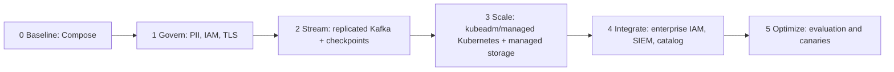

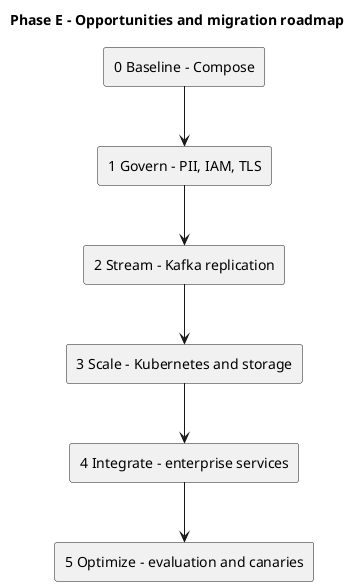

## Architecture governance

### Fintech payment-streaming extension

The payment profile specializes each ADM phase without changing the platform
trust model. Phase A adds payment service providers, merchants, fraud teams,
and card-network obligations. Phase B adds authorization, settlement,
chargeback, and anomaly-review value streams. Phase C adds the
`contexts/payments` bounded context, versioned Avro subjects, Schema Registry,
and `payments.*.v1` topics. Phase D adds TLS/SASL Kafka, three-broker KRaft
failure domains, Schema Registry, MirrorMaker 2, and LGTM telemetry. Phase E
promotes from a synthetic non-cardholder-data stream to regional active/passive
DR, replay drills, and governed model rollout.

```archimate
Business Actor "Payment Service Provider" as psp
Business Process "Authorize and settle payment" as payment
Application Component "Payment ingestion context" as ingest
Application Component "AI anomaly and risk scoring" as risk
Application Component "Schema Registry" as registry
System Software "Kafka KRaft + MirrorMaker 2" as kafka
Technology Object "Object-lock audit storage" as audit
psp --> payment
payment --> ingest
ingest --> registry
ingest --> kafka
kafka --> risk
risk --> audit
```

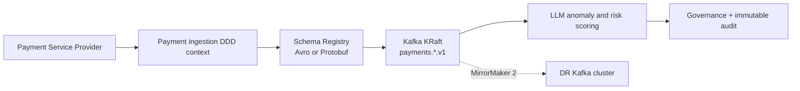

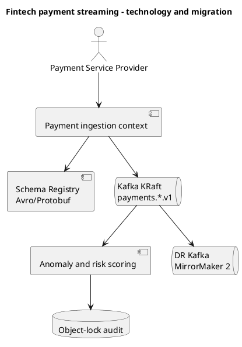

Changes to event topics, PII patterns, retention, or adapter contracts require
architecture review and a documentation update. CI must continue to validate
tests, image security, and IaC security before GitOps synchronization.

## Phase F–H — Resilience implementation, migration, and governance

### Implemented target-state controls

The application now carries an immutable correlation/causation contract across
HTTP, JSON payloads, and Kafka headers. Each request has a W3C `traceparent`;
the core propagates that context without making an OpenTelemetry library a
runtime prerequisite. The API is a CQRS command boundary: it writes
object-locked audit facts and publishes `StateTransitionLogged` plus
compensating events, while consumers may construct their own read models from
Kafka, EventStoreDB, and TimescaleDB.

| Architecture building block | Repository implementation | Operational prerequisite |
| --- | --- | --- |
| Boundary resilience | Named bulkhead, token-bucket, timeout, and Prometheus boundary metrics | Calibrated limits/SLO alerts per dependency |
| Immutable audit | S3/MinIO Object Lock COMPLIANCE writes, seven-year retention, transition/compensation prefixes | Object-lock bucket created before first write and retention reviewed |
| Event/read stores | EventStoreDB and TimescaleDB StatefulSets; MirrorMaker 2 manifest | TLS, credentials, HA sizing, projection ownership, restore drill |
| LGTM | Prometheus scrape targets plus Tempo/Loki/Grafana and OTel Collector definitions | Dashboard/alert ownership and configured Tempo endpoint |
| Zero trust | Automated SPIRE hardened stack/CSI/Controller Manager, sidecar-mode STRICT Istio PeerAuthentication, selected `rag-api` SPIFFE ID, Traefik/Coraza gateway route, and corrected DNS/ingress policy | Approved per-environment trust domain/CA subject/JWT issuer, storage class, cloud WAF route, and live mTLS/SVID evidence |
| DR | Velero BackupStorageLocation and daily PVC snapshot schedule | S3 plugin/credentials, snapshot class, quarterly isolated restore evidence |

### Migration controls

1. Apply the application and collector changes with audit storage disabled only
   in development; production cutover requires a verified object-lock bucket.
2. Deploy EventStoreDB/TimescaleDB as isolated stateful services and introduce
   consumers/projectors under a reviewed ownership model. Do not represent the
   empty service as an active source of truth.
3. For prepared K3s, EKS, AKS, or generic Kubernetes, run the provider-neutral
   `ansible/configure-mesh.yaml` (the K3s lab play remains node-specific).
   It installs SPIRE CRDs, the hardened server/agent/Controller Manager/CSI
   stack, Istio, and the gateway before rendering the selected
   `ClusterSPIFFEID` and STRICT policy. Supply the target trust domain, cluster
   name, CA subject, JWT issuer, StorageClass, and edge host, then verify the
   SVID CSI volume, sidecar, labels, service account, and plaintext rejection.
4. Create a Velero backup, restore into an isolated namespace, and reconcile
   MirrorMaker 2 before declaring the multi-cluster recovery path operational.

The lifecycle chaos suite (`tests/chaos/test_lifecycle_downstream_failure.py`)
is the Phase G conformance gate. GitHub Actions and Jenkins run the full chaos
directory so a regression in trace propagation, metrics, or compensation
prevents promotion.
