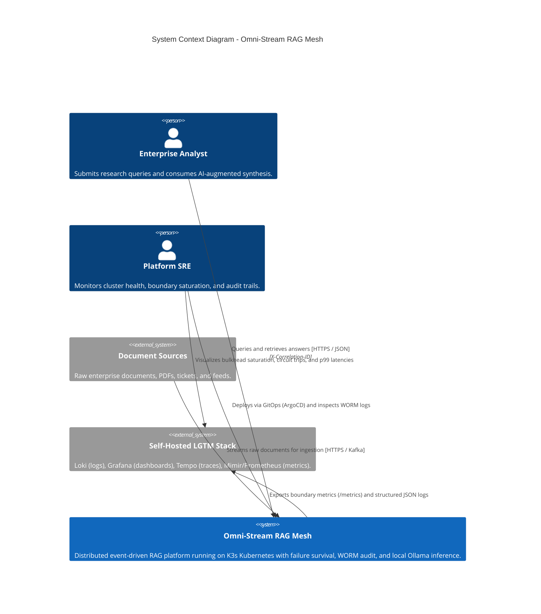

# C4 Model - Level 1: System Context

The System Context diagram illustrates the Omni-Stream RAG Mesh platform in relation to its human users, external document sources, and enterprise observability systems.

## Description of Interactions
- **Enterprise Analyst**: Sends natural language queries to the FastAPI Gateway with client-provided or auto-generated `X-Correlation-ID`.
- **Document Sources**: Ingests files into the MinIO document repository and triggers asynchronous chunking/embedding events over Kafka.
- **Platform SRE**: Monitors infrastructure and boundary resilience dashboards, and triggers GitOps synchronization via ArgoCD.
- **Self-Hosted LGTM Stack**: Continuously scrapes Prometheus metrics at `/metrics` (via Kubernetes `ServiceMonitor`) and aggregates structured JSON logs containing correlation IDs for root-cause analysis.
