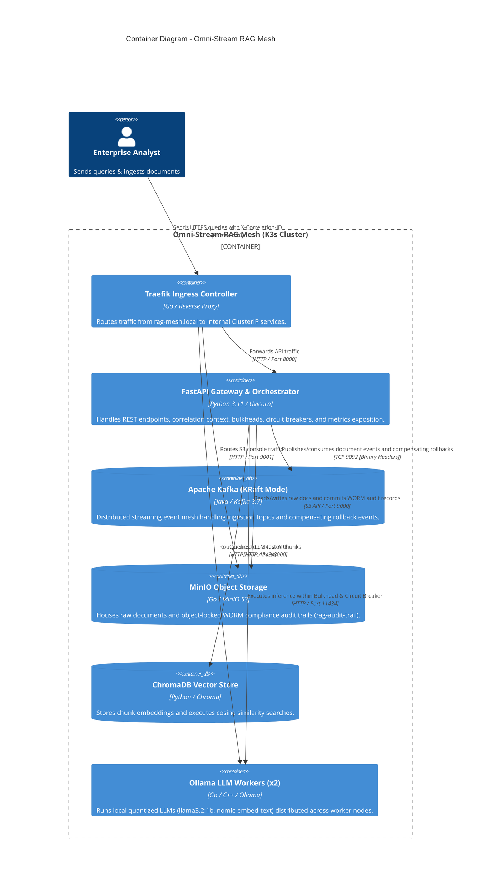

# C4 Model - Level 2: Container Diagram

The Container diagram zooms into the **Omni-Stream RAG Mesh**, illustrating the major deployable software containers, storage systems, and communication protocols.

## Container Specifications

| Container | Technology | Replicas | Persistent Storage | Description |
| :--- | :--- | :--- | :--- | :--- |
| **FastAPI Gateway** | Python 3.11-slim, PyTorch CPU, FastAPI | 2 | Stateless | Orchestrates ingestion, inference, boundary metrics, and audit logging. |
| **Kafka Broker** | Apache Kafka 3.7.0 (KRaft) | 1 (or 3) | 10Gi PVC | Event broker for document streams (`rag.documents.raw`) and rollbacks (`rag.events.compensating`). |
| **MinIO** | MinIO RELEASE.2024-03-30 | 1 | 20Gi PVC | S3 object store with WORM Compliance Object Lock enabled. |
| **ChromaDB** | chromadb/chroma:0.4.24 | 1 | 10Gi PVC | Vector embeddings database for RAG chunk search. |
| **Ollama Workers** | ollama/ollama:0.3.10 | 2 | $2 \times \text{30Gi}$ PVC | Scaled StatefulSet with `podAntiAffinity` enforcing distribution across worker nodes. |
