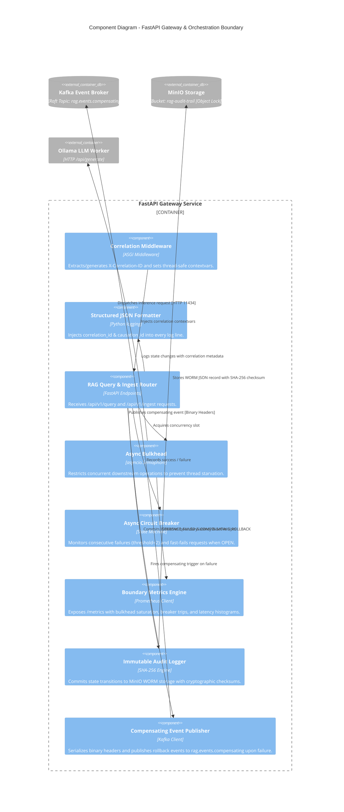

# C4 Model - Level 3: Component Diagram (FastAPI Gateway)

The Component diagram zooms into the **FastAPI Gateway** container to depict its internal software components, concurrency isolation layers, and failure compensation handlers.

## Internal Component Details

1. **Correlation Middleware**:
   - Ensures zero untracked requests by binding `current_correlation_id` and `current_causation_id` to async coroutines.
2. **Async Bulkhead**:
   - Manages bounded concurrency (default 5 slots per Ollama replica). Increments `rag_bulkhead_saturated_total` when capacity is exceeded.
3. **Async Circuit Breaker**:
   - Enforces a 3-state machine (`CLOSED`, `HALF_OPEN`, `OPEN`). When 2 consecutive failures occur, it trips to `OPEN`, immediately fast-failing traffic to protect downstream pods.
4. **Immutable Audit Logger**:
   - Calculates a canonical SHA-256 hash over the transaction metadata before persisting to MinIO WORM storage (`rag-audit-trail`).
5. **Compensating Event Publisher**:
   - Binds binary correlation headers to rollback messages on `rag.events.compensating` to trigger cleanup in ChromaDB and notify upstream callers.
