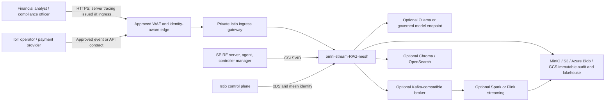
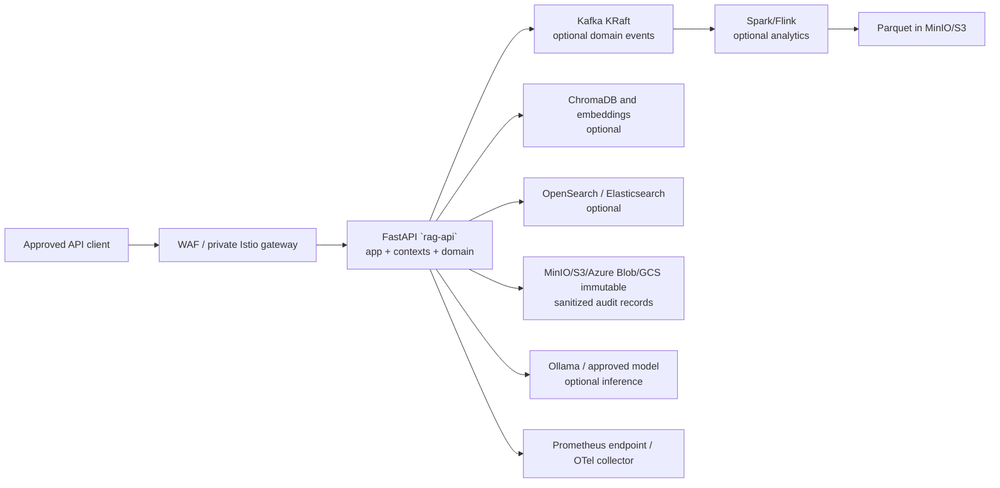
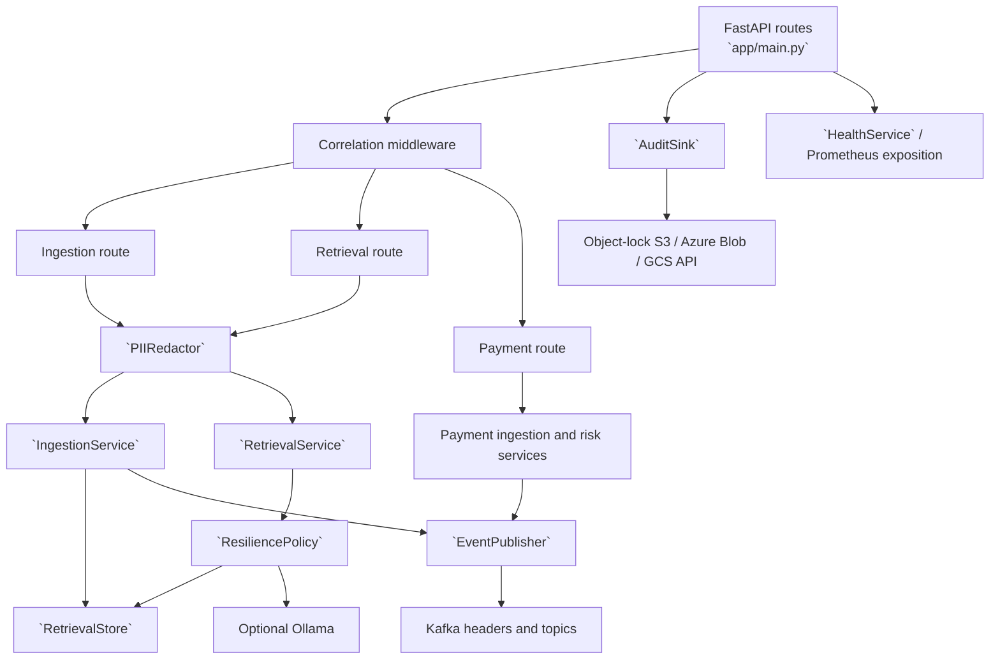
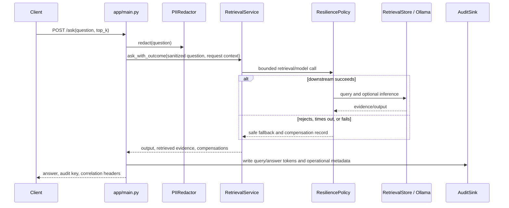
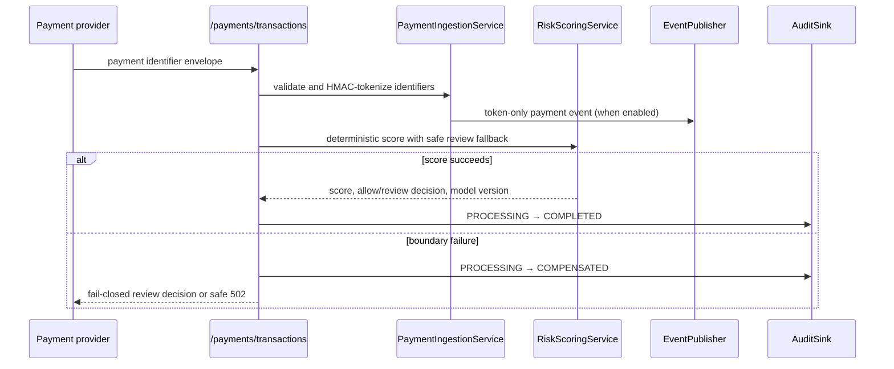

# C4 model

## Purpose and maintenance rule

This is the complete C4 model for Hybrid Streaming RAG. It combines the former
context, container, component, and dynamic-code documents so contributors have
one traceable view from an external actor to the implemented Python code.

The diagrams distinguish **implemented** components from optional deployment
adapters. A configured dependency is not automatically enabled in the local
profile. Update this document in the same pull request when a public API,
deployment container, bounded context, external dependency, or cross-boundary
data flow changes.

| C4 level | Answers | Project use |
| --- | --- | --- |
| Level 1 — System context | Who uses the system and what external systems it depends on | Define trust, ownership, and integration boundaries. |
| Level 2 — Containers | What deployable/runtime responsibilities collaborate | Design deployment, capacity, and network controls. |
| Level 3 — Components | How `rag-api` is structured internally | Keep code ownership and privacy/resilience boundaries explicit. |
| Level 4 — Code/dynamic | How a request and failure move through concrete code | Review behavior, audits, and tests for an endpoint change. |

## Level 1 — System context

`omni-stream-RAG-mesh` accepts approved client traffic through a platform edge.
It provides sanitized evidence ingestion, retrieval, payment-risk baseline
processing, event publication, and immutable audit evidence. The edge,
authentication/authorization, identity provider, cloud network, and
compliance controls are owned by the target platform, not the FastAPI process.



**Boundary rules**

- The edge may forward only to the private Istio gateway; it must not call
  `rag-api` directly.
- The RAG ingress canonicalizes and HMAC-tokenizes known PII before an external
  storage, model, search, or event adapter sees content. It HMAC-tokenizes
  source and payment identifiers before metadata/events leave the process.
- Audit storage receives only server-issued correlation identifiers, HMAC
  tokens, and operational metadata; it never receives raw prompts, evidence,
  answers, sources, or payment identifiers.
- SPIRE supplies the application SVID and Istio supplies mesh mTLS; these are
  complementary, not interchangeable, controls.
- The caller-visible operation contract is in
  [the API and contributor guide](../API_AND_CONTRIBUTOR_GUIDE.md).

## Level 2 — Containers

The platform has a single deployable FastAPI service and optional stateful
runtime containers. The current bounded contexts are logical modules inside
the API service, not independently deployed microservices.



| Container | Responsibility | Deployment and control |
| --- | --- | --- |
| FastAPI `rag-api` | HTTP boundary, PII redaction, business orchestration, audit lifecycle | Two Kubernetes replicas by default; selected SPIFFE ID and Istio sidecar when mesh is enabled. |
| Kafka | Optional immutable domain-event transport | Production requires reviewed replication, retention, access controls, idempotency/replay design, and consumer ownership. |
| Chroma / OpenSearch | Optional vector/search retrieval | Stores sanitized material only; its availability and recovery are operator responsibilities. |
| Ollama | Optional local inference and embeddings | Operate privately with an approved model, resource limits, model governance, and transport timeout. |
| MinIO/S3/Azure Blob/GCS | Immutable audit evidence and data lake output | Create and lock the bucket/container before enabling its S3, Azure Blob, or GCS adapter; preserve retention in recovery. |
| Spark/Flink | Optional event windowing and Parquet output | Configure checkpoints/savepoints, schemas, connector JARs, and data ownership before use. |
| Observability stack | Metrics, traces, logs, and stateful views | Compose/Kubernetes examples are extension points; the platform owns alert delivery and retention. |

## Level 3 — `rag-api` components



| Component | Code | Contract |
| --- | --- | --- |
| HTTP routes and middleware | `app/main.py` | Validates payloads; issues server request, correlation, and trace headers; discards caller tracing headers; records transitions. |
| Redaction | `app/redaction.py` | Canonicalizes recognised PII and produces versioned 128-bit HMAC tokens; applies a defense-in-depth audit/event boundary guard. |
| Ingestion | `contexts/ingestion/services.py` | Creates `DocumentChunk` entities and `TelemetryIngested` events. |
| Retrieval | `contexts/ai/services.py` | Retrieves sanitized evidence and optional model output. |
| Resilience policy | `contexts/ai/resilience.py` | Bounded timeout, bulkhead, rate-limiter, safe fallback, and metrics behavior. |
| Payments | `contexts/payments/services.py` | Validates an ingress-only identifier envelope, tokenizes it before emitting events, and produces a deterministic risk baseline. |
| Event publisher | `contexts/governance/publisher.py` | Publishes immutable domain events and protected correlation headers when enabled; fails closed if a final privacy guard detects an unsanitized event/header. |
| Storage/audit | `app/storage.py`, `app/audit.py` | Optional retrieval adapters and canonical sanitized audit records. |
| Health/metrics | `app/health.py`, `app/metrics.py` | Probe reports, projected-SVID readiness when mesh-enabled, and bounded-cardinality Prometheus exposition. |

The detailed event names and topic contracts are listed in the
[architecture and operations guide](../ARCHITECTURE_AND_OPERATIONS.md). A change
to a topic or semantic field requires consumer migration planning.

## Level 4 — dynamic code flows

### Ingestion and audit

```mermaid
sequenceDiagram
    participant Client
    participant API as app/main.py
    participant Redactor as PIIRedactor
    participant Ingest as IngestionService
    participant Store as RetrievalStore
    participant Audit as AuditSink
    participant Events as EventPublisher

    Client->>API: POST /ingest-sample
    API->>API: discard caller trace headers; issue server IDs
    API->>Redactor: redact(text), HMAC-tokenize(source)
    Redactor-->>API: sanitized text, source token, PII counts
    API->>Ingest: ingest(sanitized text, source token, request context)
    Ingest->>Events: TelemetryIngested (when enabled)
    API->>Store: add sanitized chunks
    alt store and audit succeed
        API->>Audit: write tokens, server IDs, operational metadata
        API->>Events: AuditRecordLogged (when enabled)
        API-->>Client: chunk count, audit key, correlation headers
    else store or audit fails
        API->>Store: remove new chunks when audit write fails
        API->>Audit: PROCESSING → COMPENSATED
        API->>Events: compensating event (when enabled)
        API-->>Client: safe 502/503 failure and correlation headers
    end
```

### Retrieval, fallback, and compensation



### Payment decision



## Applying C4 to project changes

1. Start at Level 1 when a change adds an actor, external dependency, trust
   boundary, or data owner.
2. Update Level 2 when it adds/removes a deployable, queue, database, network
   route, or observability component.
3. Update Level 3 when it changes the responsibility or dependency of code in
   `app/`, `contexts/`, or `domain/`.
4. Update Level 4 and tests when it changes request ordering, a side effect,
   failure/compensation path, audit record, event, or correlation propagation.
5. Keep the API guide, this C4 model, and the TOGAF document synchronized in
   the pull request. Diagrams document current behavior; they must not claim
   external production controls that have not been verified.

The C4 levels provide the implementation views for the TOGAF Phase C/D
application and technology architecture. The
[TOGAF/ADM implementation](../TOGAF_Architecture_Definition.md) defines the
governance and migration process that uses these views.
