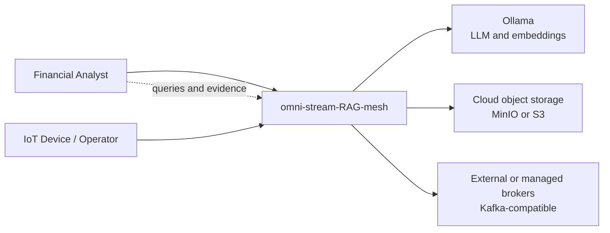

# C4 Level 1 — System context

The system context shows the people, devices, external model service, object
storage, and broker boundary around omni-stream-RAG-mesh.

Financial analysts use the API for evidence ingestion and retrieval questions.
IoT devices/operators contribute telemetry through the event boundary.
Ollama, object storage, and Kafka are replaceable deployment dependencies.
