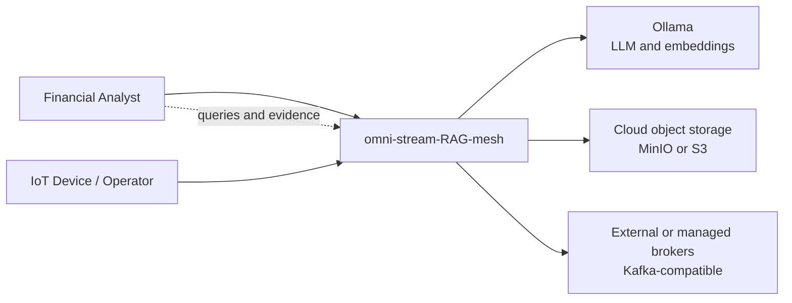
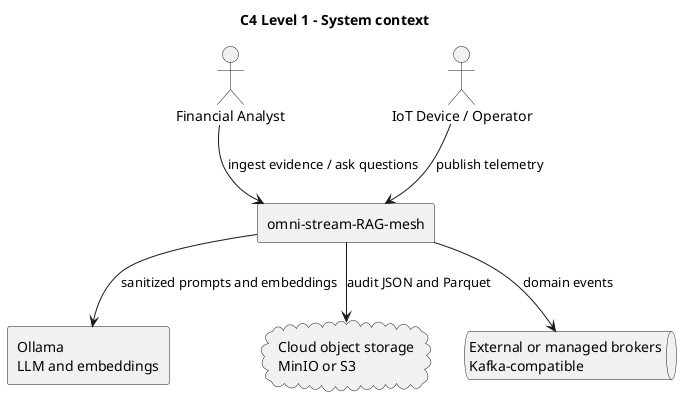

# C4 Level 1 — System context

The system context shows the people, devices, external model service, object
storage, and broker boundary around omni-stream-RAG-mesh.



Financial analysts use the API for evidence ingestion and retrieval questions.
IoT devices/operators contribute telemetry through the event boundary.
Ollama, object storage, and Kafka are replaceable deployment dependencies.



```archimate
Business Actor "Financial Analyst" as analyst
Business Actor "IoT Device / Operator" as operator
Application Component "omni-stream-RAG-mesh" as system
Application Component "Ollama" as ollama
Technology Object "MinIO or S3 object storage" as storage
Technology Service "Kafka-compatible broker" as broker
analyst --> system
operator --> system
system --> ollama
system --> storage
system --> broker
```
