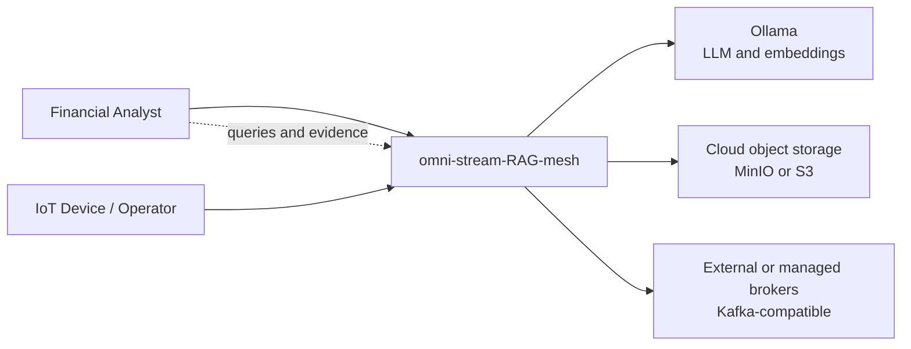
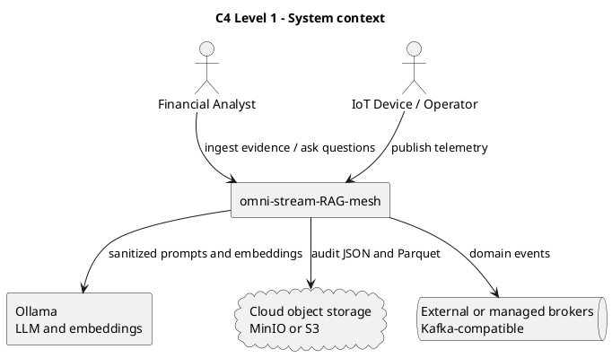
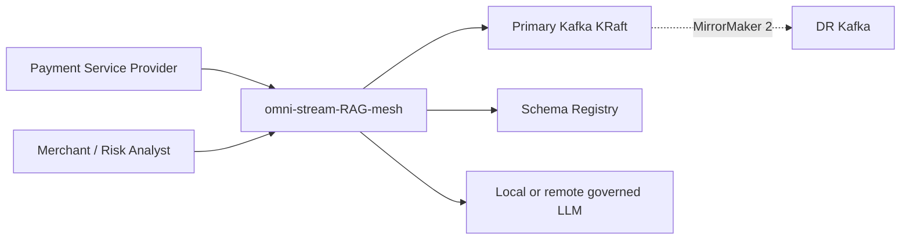
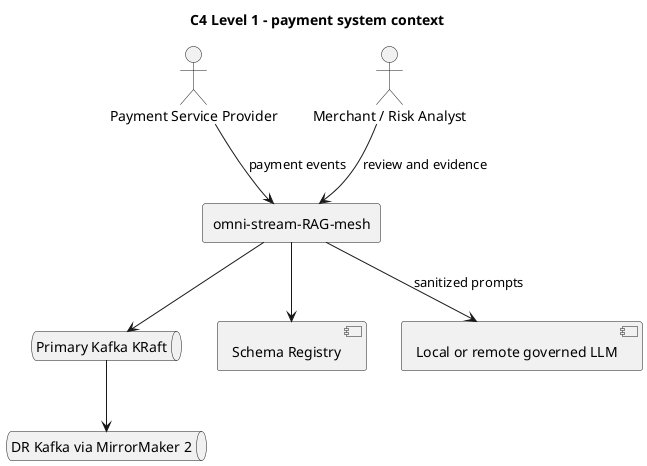
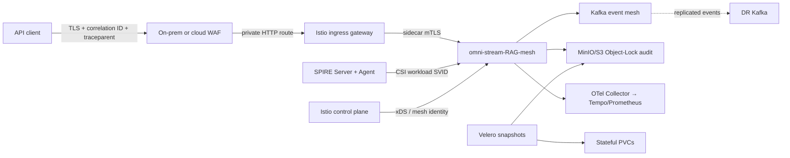

# C4 Level 1 — System context

The system context shows the people, devices, external model service, object
storage, and broker boundary around omni-stream-RAG-mesh.



Financial analysts use the API for evidence ingestion and retrieval questions.
IoT devices/operators contribute telemetry through the event boundary.
Ollama, object storage, and Kafka are replaceable deployment dependencies.



```archimate
Business Actor "Financial Analyst" as analyst
Business Actor "IoT Device / Operator" as operator
Application Component "omni-stream-RAG-mesh" as system
Application Component "Ollama" as ollama
Technology Object "MinIO or S3 object storage" as storage
Technology Service "Kafka-compatible broker" as broker
analyst --> system
operator --> system
system --> ollama
system --> storage
system --> broker
```

## Payment streaming extension





## Resilience and recovery context



The client-visible contract is a returned correlation ID and W3C traceparent.
The platform records either a completed or compensated state transition. The
edge is an organization/provider WAF in the primary kubeadm and cloud profiles;
the retained K3s lab uses Traefik/Coraza. All route only to the private Istio
gateway. SPIRE provides an application SVID through the CSI driver while Istio
sidecars enforce workload mTLS. Kafka, Object Lock, and LGTM are separate system
boundaries; Velero protects the Kubernetes/PVC recovery path rather than
replacing immutable audit retention.
