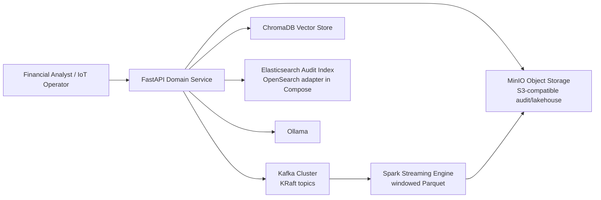

# C4 Level 2 — Container

Containers are logical deployable/runtime responsibilities. The names reflect
the current repository components and optional adapters.

`FastAPI Domain Service` corresponds to `app/` plus `contexts/` and `domain/`.
The event publisher and streaming engine are disabled or deployed separately
unless their environment/deployment flags are enabled.
