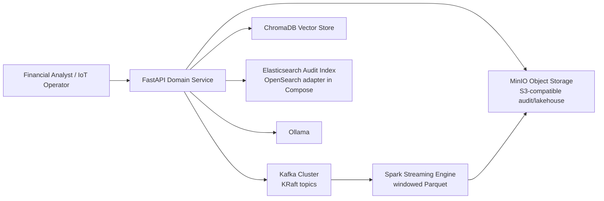
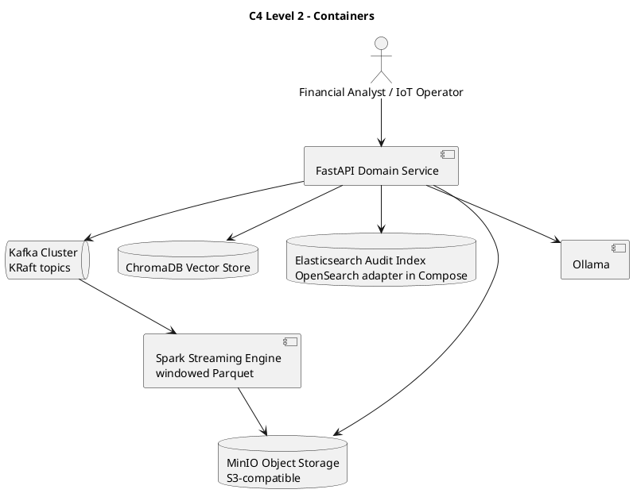

# C4 Level 2 — Container

Containers are logical deployable/runtime responsibilities. The names reflect
the current repository components and optional adapters.



`FastAPI Domain Service` corresponds to `app/` plus `contexts/` and `domain/`.
The event publisher and streaming engine are disabled or deployed separately
unless their environment/deployment flags are enabled.



```archimate
Business Actor "Financial Analyst / IoT Operator" as user
Application Component "FastAPI Domain Service" as api
Application Component "Kafka Cluster" as kafka
Application Component "Spark Streaming Engine" as spark
Application Component "ChromaDB Vector Store" as chroma
Application Component "Elasticsearch Audit Index" as elastic
Technology Object "MinIO Object Storage" as minio
Application Component "Ollama" as ollama
user --> api
api --> kafka
kafka --> spark
api --> chroma
api --> elastic
api --> minio
api --> ollama
spark --> minio
```
