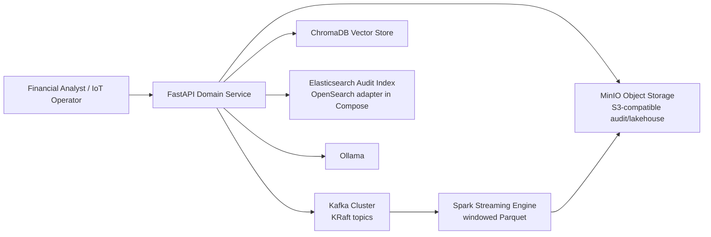
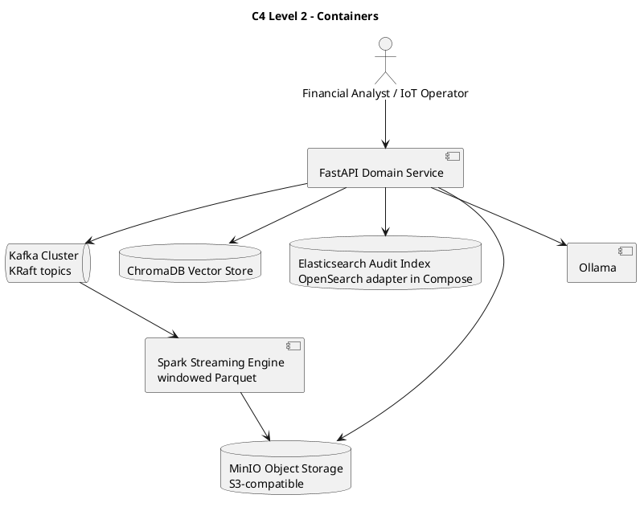
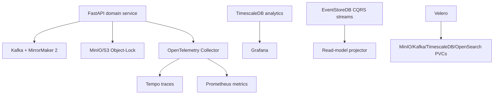
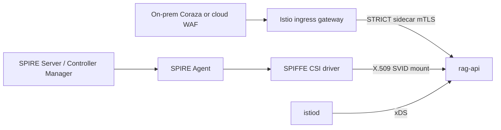
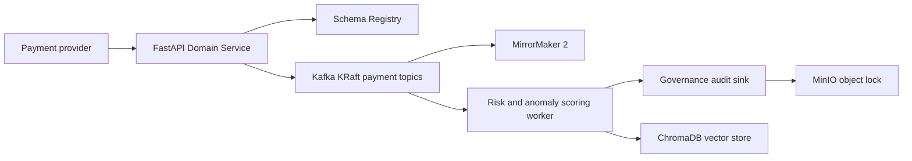
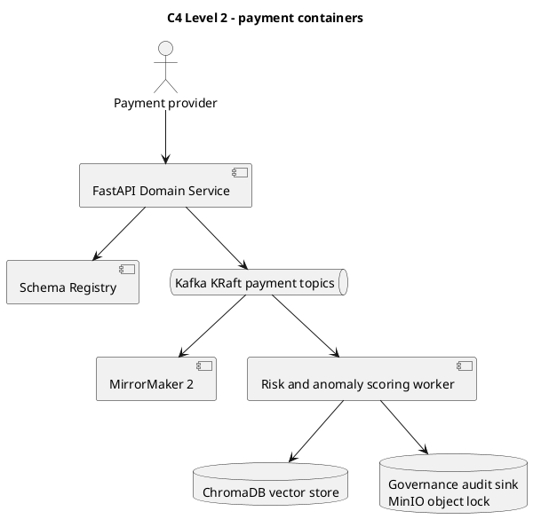

# C4 Level 2 — Container

Containers are logical deployable/runtime responsibilities. The names reflect
the current repository components and optional adapters.



`FastAPI Domain Service` corresponds to `app/` plus `contexts/` and `domain/`.
The event publisher and streaming engine are disabled or deployed separately
unless their environment/deployment flags are enabled.



## Resilience, observability, and state containers



`EventStoreDB` and `TimescaleDB` are delivered as optional stateful containers
in Compose and Kubernetes. A production projector is intentionally not
hard-wired into the Python API: its replay and schema ownership must be
approved by the deployment team. The collector transports OTLP telemetry; the
API's dependency-free Prometheus endpoint remains directly scrapeable.

## Workload identity and edge containers



`ansible/configure-mesh.yaml` creates this topology on a prepared Kubernetes
target. Its `ClusterSPIFFEID` selects only `rag-api` by namespace and stable
labels, and its CSI volume is part of the Helm deployment when the mesh profile
is enabled. The WAF is platform-specific but has a common invariant: it cannot
bypass the Istio gateway to reach the application service directly. SPIRE SVID
issuance and Istio mTLS are distinct controls.

```archimate
Business Actor "Financial Analyst / IoT Operator" as user
Application Component "FastAPI Domain Service" as api
Application Component "Kafka Cluster" as kafka
Application Component "Spark Streaming Engine" as spark
Application Component "ChromaDB Vector Store" as chroma
Application Component "Elasticsearch Audit Index" as elastic
Technology Object "MinIO Object Storage" as minio
Application Component "Ollama" as ollama
user --> api
api --> kafka
kafka --> spark
api --> chroma
api --> elastic
api --> minio
api --> ollama
spark --> minio
```

## Payment containers




