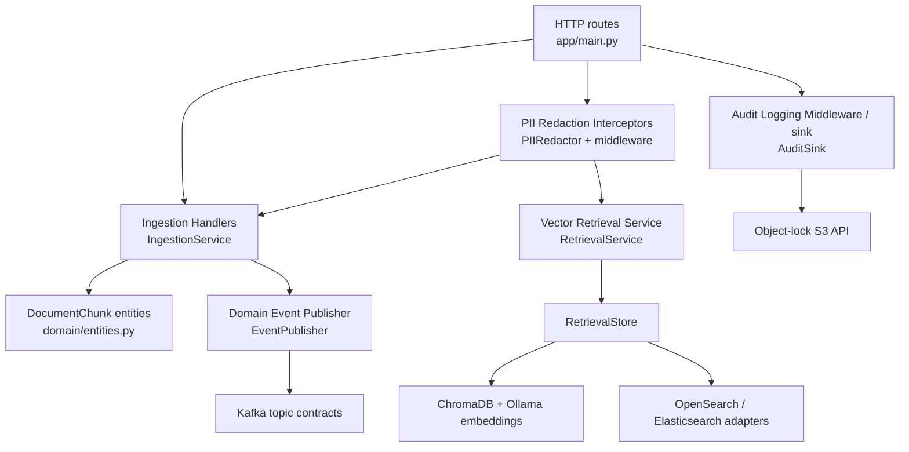

# C4 Level 3 — Component

This view expands the FastAPI Domain Service into the implemented DDD
components. The middleware marks the boundary; route/domain services perform
the actual redaction before external adapters are called.

The `MetadataIndex` adapter is available for Elasticsearch metadata indexing,
while `RetrievalStore` uses the configured OpenSearch endpoint for the current
search path. `AuditRecordLogged` is published after a successful audit write.
