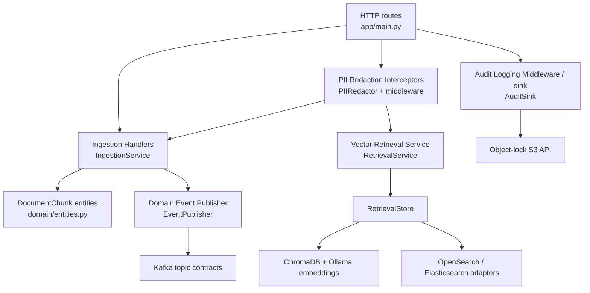
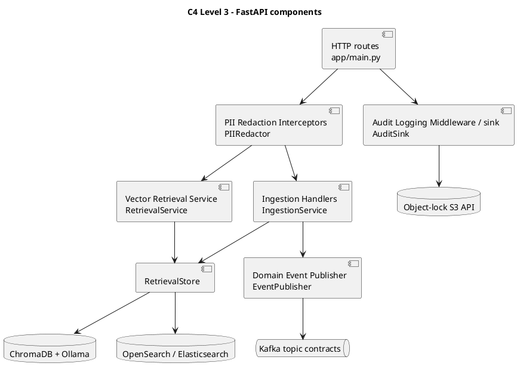

# C4 Level 3 — Component

This view expands the FastAPI Domain Service into the implemented DDD
components. The middleware marks the boundary; route/domain services perform
the actual redaction before external adapters are called.



The `MetadataIndex` adapter is available for Elasticsearch metadata indexing,
while `RetrievalStore` uses the configured OpenSearch endpoint for the current
search path. `AuditRecordLogged` is published after a successful audit write.



```archimate
Application Component "HTTP routes" as http
Application Component "Ingestion Handlers" as ingest
Application Component "PII Redaction Interceptors" as redact
Application Component "Vector Retrieval Service" as retrieval
Application Component "RetrievalStore" as store
Application Component "Audit Logging Middleware / sink" as audit
Technology Service "Kafka topics" as kafka
Technology Object "Object-lock S3 API" as object
http --> redact
redact --> ingest
redact --> retrieval
ingest --> store
retrieval --> store
ingest --> kafka
http --> audit
audit --> object
```
