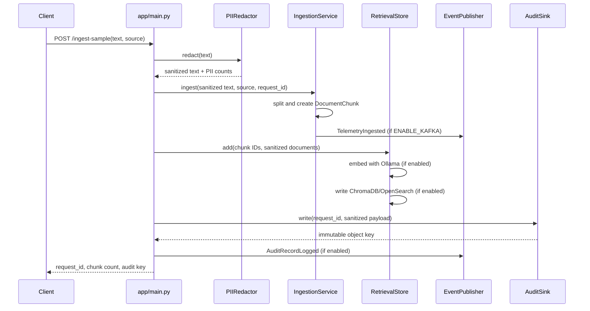
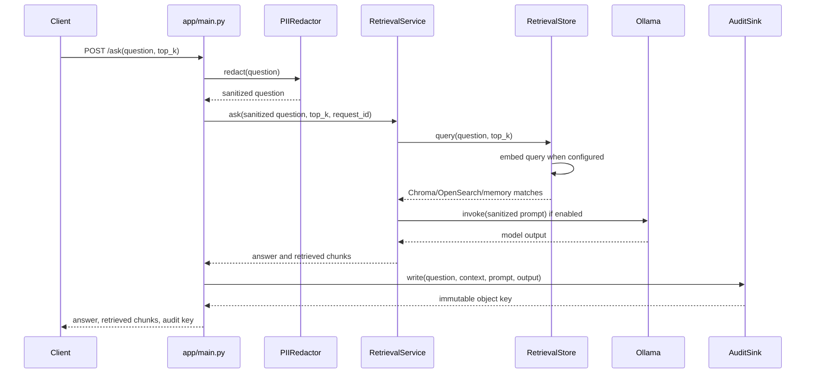
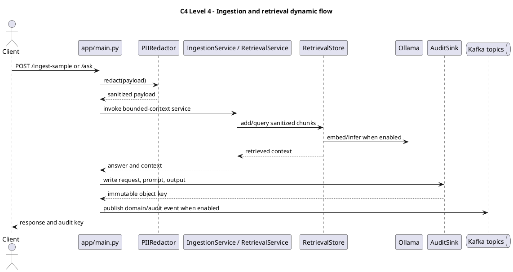

# C4 Level 4 — Code and dynamic flow

The repository is Python rather than a single compiled-code diagram, so this
level traces the concrete functions/classes used by the two primary flows.

## Ingestion sequence



## Retrieval sequence



## Concrete code map

| Concern | Code |
| --- | --- |
| HTTP schemas/routes | `app/main.py` |
| Pattern matching/token generation | `app/redaction.py` |
| Chunk entity | `domain/entities.py` |
| Event serialization/topic mapping | `domain/events.py` |
| Chunking and telemetry event | `contexts/ingestion/services.py` |
| Retrieval and optional LLM | `contexts/ai/services.py` |
| Vector/search adapters | `app/storage.py` |
| Immutable audit write | `app/audit.py` |



```archimate
Business Actor "API Client" as client
Application Function "PII redaction" as redact
Application Function "Ingestion or retrieval service" as service
Application Service "Vector/search retrieval" as retrieval
Application Service "Immutable audit logging" as audit
Technology Service "Kafka event publication" as kafka
client --> redact
redact --> service
service --> retrieval
service --> audit
service --> kafka
```
