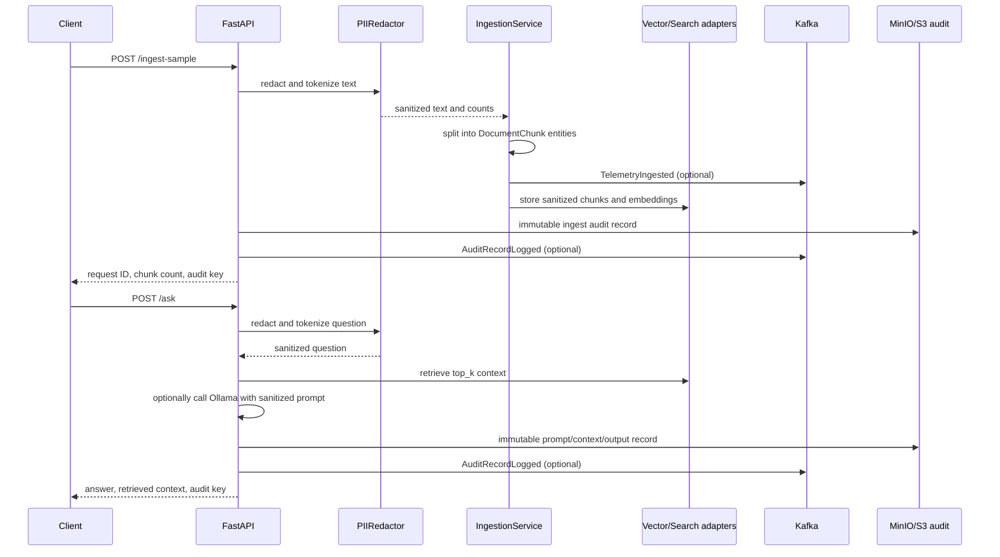
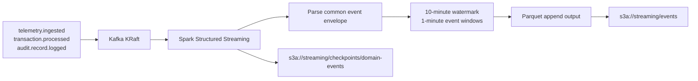

# End-to-end data flows

## Ingestion and retrieval

The audit write is part of the request success path. If the enabled audit
client fails, the API returns HTTP 503 rather than reporting a successful
request without an audit key. With `ENABLE_AUDIT_STORE=false`, a deterministic
audit key is returned and the record is logged as retained in the application
event stream rather than sent to S3.

## Streaming analytics

`streaming/spark_job.py` is submitted with Spark connectors for Kafka and
Parquet/S3. The Compose service mounts the job; the Kubernetes manifest
provides a CronJob and ConfigMap placeholder for pipeline replacement.
`streaming/flink-job.yaml` remains an additional deployment extension point,
not an implementation used by the FastAPI process.
