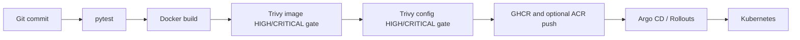

# Delivery and operations

## CI/CD flow

`.github/workflows/ci.yml` runs tests, builds the image, and blocks on unfixed
HIGH/CRITICAL Trivy image and IaC findings with read-only repository
permissions. `.github/workflows/publish-deploy.yml` only publishes on a
version tag or explicit dispatch; it loads the image, applies the same
HIGH/CRITICAL Trivy image gate, and pushes only after that scan passes. It
deploys only when the protected
`production` environment and `KUBE_CONFIG` secret are supplied. `Jenkinsfile`
provides the same gates; publishing is opt-in parameters using Jenkins
credentials. No credentials belong in repository files.

Argo CD should synchronize reviewed manifests after an immutable image tag is
published. Kubernetes runtime secrets must be resolved from an external secret
manager (or an equivalent protected CI secret), not committed `stringData`.
Terraform and Ansible are operated separately with reviewed plans and
least-privilege identities.

## Configuration

Feature flags and endpoints are environment-driven. Important switches include
`ENABLE_KAFKA`, `ENABLE_AUDIT_STORE`, `ENABLE_VECTOR_STORE`,
`ENABLE_SEARCH_STORE`, `ENABLE_METADATA_INDEX`, and
`ENABLE_OLLAMA_INFERENCE`. Keep `.env` local and use Kubernetes Secret or
external-secret references in shared environments.

## Observability and health

`/healthz` is a liveness endpoint and `/readyz` is a readiness endpoint.
Application logs use the configured `LOG_LEVEL` and include request IDs for
audit failures. Kafka lag, Spark query progress, object-store errors,
OpenSearch/Elasticsearch health, Ollama model availability, PVC usage, and
probe failures should be collected by the host platform; no metrics backend is
bundled in this repository.

## Resilience and scaling

The API is stateless and the Kubernetes manifest starts two replicas. Scale
API replicas independently from Kafka and storage. For production, use a
multi-broker Kafka deployment with replication and min-insync settings,
replicated/object-locked storage, OpenSearch snapshots, Spark checkpoints and
savepoints, and a highly available ingress. Optional adapters fail closed or
fall back to in-memory behavior according to their implementation; verify
that fallback is acceptable before enabling production traffic.

Retrieval calls use dependency-free equivalents of Resilience4j patterns:
`contexts/ai/resilience.py` applies a bounded bulkhead, token-bucket rate
limiter, and timeout around vector retrieval and Ollama inference. Timeouts and
rejections return the configured safe fallback answer rather than cascading
into request failure. Configure limits by constructing `ResiliencePolicy` in
the service composition layer; keep values aligned with worker capacity and
LLM provider quotas. The Python implementation is intentional because this
service is Python; Resilience4j is the equivalent pattern name for JVM
integrations, not an added runtime dependency.

The scheduled `.github/workflows/chaos.yml` job runs deterministic failure
injection tests under `tests/chaos/`. It validates slow model behavior and
fallback isolation without requiring live cloud services. Run the same suite
in a staging cluster with network faults, broker unavailability, vector-store
latency, and Ollama saturation before enabling production changes.

## Disaster recovery

Back up and periodically restore MinIO/S3 audit objects, Parquet data and
Spark checkpoints, OpenSearch/Elasticsearch indices, and deployment
configuration. Preserve object-lock retention during recovery. Rebuild
Chroma indexes from the sanitized source-of-truth data when needed, validate
event schema compatibility before replaying Kafka, and document regional
residency and recovery objectives with the service owner.
