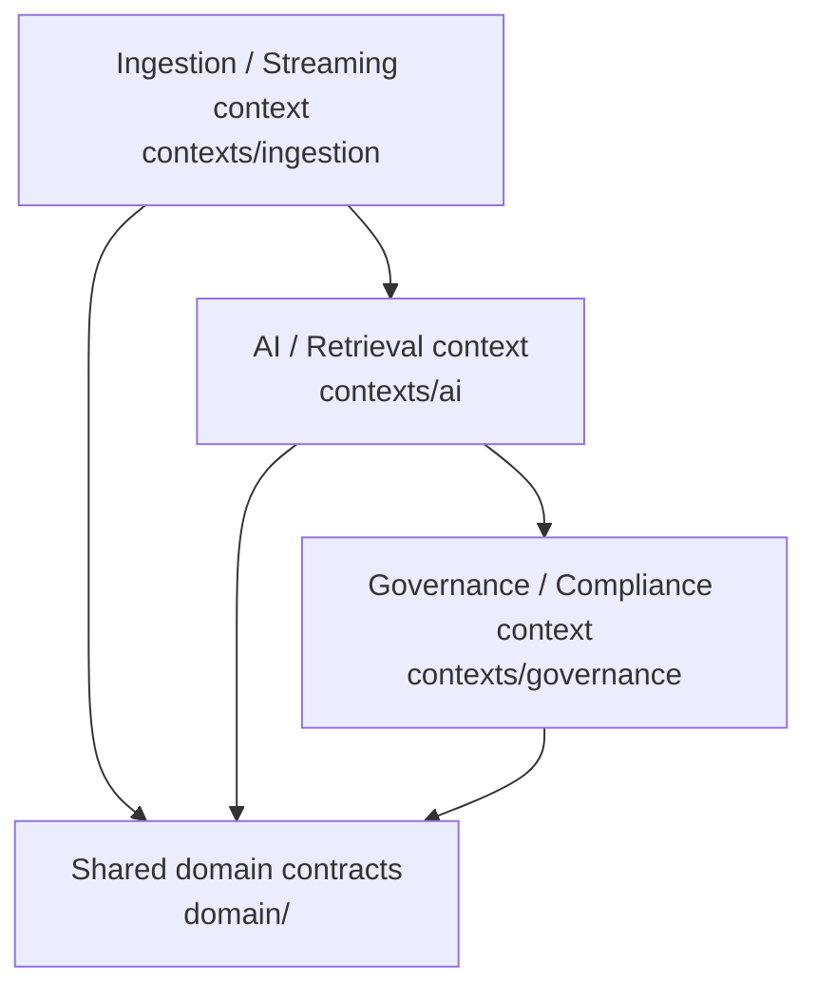

# DDD bounded contexts and event contracts

## Bounded contexts

### Ingestion / Streaming

`IngestionService` receives text, applies the `PIIRedactor`, creates
`DocumentChunk` entities, and emits `TelemetryIngested`. The service uses the
LangChain recursive splitter when installed and a bounded fallback splitter
otherwise.

### AI / Retrieval

`RetrievalService` retrieves from `RetrievalStore` and optionally invokes an
Ollama model. `RetrievalStore` supports ChromaDB with Ollama embeddings,
OpenSearch keyword/full-text retrieval, and an in-process memory fallback for
development and tests.

### Governance / Compliance

`EventPublisher` is an optional Kafka producer. `AuditSink` serializes request
IDs, sanitized prompts/questions, retrieved context, model output, and
ingestion metadata to object storage. `MetadataIndex` is an independent,
opt-in Elasticsearch adapter for create-only metadata indexing.

## Kafka event/topic mapping

Events are frozen dataclasses in `domain/events.py`. Their `topic` class
variable is the integration contract.

| Event | Kafka topic | Emitted by | Key payload |
| --- | --- | --- | --- |
| `TelemetryIngested` | `telemetry.ingested` | `IngestionService` | request ID, source, chunk count, PII counts |
| `TransactionProcessed` | `transaction.processed` | Domain/integration producers | request and transaction IDs, status, metadata |
| `AuditRecordLogged` | `audit.record.logged` | API after audit write | request ID, object key, record type |
| `StateTransitionLogged` | `state.transition.logged` | API lifecycle coordinator | from/to state and safe transition reason |
| `IngestionCompensated` | `ingestion.compensated` | Ingestion failure handler | source, request ID, compensation reason |
| `TransactionCompensated` | `transaction.compensated` | Retrieval/audit failure handler | transaction/request ID, dependency-safe error class |
| `PaymentCompensated` | `payments.compensated.v1` | Risk scoring failure handler | fail-closed `review` decision and reason |

`DomainEvent.to_dict()` adds `event_type` and `topic`, while `to_json()` emits
stable sorted JSON. Every payload includes generated immutable `event_id`,
`correlation_id`, and `causation_id`, plus `traceparent` when HTTP context is
available. `headers()`/`kafka_headers()` mirrors those values as UTF-8 Kafka
headers with `event_type`. Kafka publication is disabled unless
`ENABLE_KAFKA=true`.

Root events receive a generated causation ID. A derived event uses the source
event ID as `causation_id`; for example, `PaymentRiskScored` and
`PaymentCompensated` are caused by `PaymentTransactionIngested`. This makes the
causation chain inspectable independently of broker-specific metadata.

## Contract evolution

Consumers should treat event names and topics as stable integration contracts.
Additive fields are preferred; changes to field meaning or topic names require
coordinated consumer updates. The Spark job currently parses the common
`event_id`, `event_type`, `occurred_at`, and `request_id` fields.
