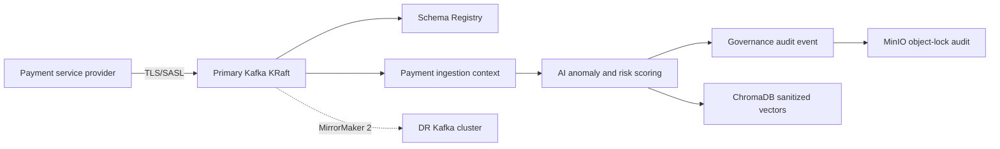

# Fintech payment streaming architecture

This extension adds a payment-streaming profile to omni-stream-RAG-mesh. It
defines contracts and deployment integration points without claiming that a
local Compose deployment is PCI-certified or that a model is an autonomous
credit decision-maker.

## Bounded contexts and contracts

```text
contexts/
  payments/              # transaction ingestion and risk-score application services
  ai/                    # governed anomaly/RAG inference and resilience policy
  governance/            # audit publication and immutable retention
domain/events.py         # versioned integration event types
infrastructure/fintech/
  schemas/               # Avro contracts for registry promotion
```

The payment context emits:

| Event | Kafka topic | Contract |
| --- | --- | --- |
| `PaymentTransactionIngested` | `payments.transaction.ingested.v1` | `payment_transaction_ingested.avsc` |
| `PaymentRiskScored` | `payments.risk.scored.v1` | `payment_risk_scored.avsc` |

Payment events contain tokenized identifiers and amount-in-minor-units. PAN,
CVV, authorization secrets, and raw request bodies are not event fields. The
publisher must enforce `acks=all`, idempotent producer settings, a stable
`event_id`, and a key of `transaction_id` to preserve per-transaction order.

## Streaming backbone

The production topology uses Kafka KRaft with three or more brokers per
failure domain, replication factor three, `min.insync.replicas=2`, TLS/SASL,
ACLs, and disabled auto-topic creation. Schema Registry compatibility is
`BACKWARD`; registry subjects and Avro artifacts are declared in
[`infrastructure/fintech/schema-registry-subjects.yaml`](../infrastructure/fintech/schema-registry-subjects.yaml)
and [`infrastructure/fintech/schemas/`](../infrastructure/fintech/schemas/).
Protobuf may be substituted when the organization standardizes on a protobuf
serializer; the topic and compatibility policy remain unchanged.

MirrorMaker 2 replicates only the `payments.*` topics and payment consumer
groups between explicitly named primary and disaster-recovery clusters. The
Strimzi integration contract is in
[`k8s/schema-registry-mirrormaker2.yaml`](../k8s/schema-registry-mirrormaker2.yaml).
Use separate TLS trust material, quotas, and ACLs per cluster. Do not mirror
PII vaults or raw audit objects as a shortcut for residency controls.



## Health and synthetic monitoring

`/health/live` is process-only. `/health/ready` and `/health/startup` perform
bounded checks for Kafka, Schema Registry, ChromaDB, MinIO, and Ollama/local or
remote LLM configuration. A dependency is `disabled` only when its endpoint is
not configured; a configured failure returns HTTP 503. The Schema Registry
check uses `SCHEMA_REGISTRY_URL` and does not expose its URL or credentials in
the response.

Prometheus `/metrics` exports fixed dependency labels, durations, and readiness
status. Synthetic payment verification should publish a non-sensitive test
transaction to an isolated topic, verify schema acceptance and risk-event
correlation, then remove or expire the test record according to the retention
policy. Route the resulting metrics to the self-hosted LGTM stack; never use
real cardholder data for probes.

## Security, resilience, and operations

- Place tokenization before serialization, embedding, or LLM calls; use a
  managed secret for token salt and rotate it under a documented migration plan.
- Enforce mTLS between clusters and registry, least-privilege ACLs, network
  policies, and external secret injection.
- Apply bounded bulkheads, token-bucket rate limits, and timeouts around
  registry, vector, and LLM calls. A timeout or rejected inference produces a
  review-safe fallback, never an allow decision.
- Test broker loss, registry unavailability, delayed model responses, duplicate
  events, and MirrorMaker lag with deterministic chaos tests before promotion.
- Keep immutable audit objects and model metadata in the retention-controlled
  object-lock bucket. Index only sanitized metadata in Elasticsearch/OpenSearch.

## TOGAF and C4 traceability

The payment profile extends the enterprise views in
[`TOGAF_Architecture_Definition.md`](TOGAF_Architecture_Definition.md) and
[`c4-model/`](c4-model/): payment actors and providers are Phase A/B concerns;
versioned schemas, registry, and DDD services are Phase C; KRaft, mTLS,
MirrorMaker 2, and LGTM are Phase D; and regional rollout, replay, and DR
cutover are Phase E transition concerns.
