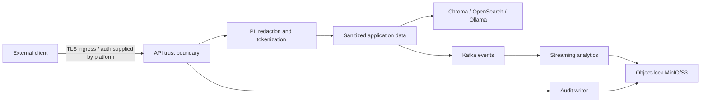

# Security, privacy, and trust boundaries

## Trust boundaries

The repository establishes the sanitization boundary in application code. TLS,
authentication, authorization, ingress, and identity-provider integration are
deployment responsibilities; the Kubernetes resources include a default-deny
NetworkPolicy and a cert-manager extension point but do not claim to implement
end-user authentication.

## PII redaction and tokenization

`app/redaction.py` recognizes email, phone, payment-card, and SSN patterns.
Matches are replaced before chunking, embeddings, retrieval, or LLM
inference with deterministic SHA-256-derived tokens containing a kind and
truncated digest. `PII_TOKEN_SALT` is environment-driven and must be stored in
a secret manager. Tokenization is irreversible within the application and
should be treated as defense-in-depth, not a substitute for DLP, access
control, or data classification.

## Immutable audit controls

When `ENABLE_AUDIT_STORE=true`, `AuditSink` writes canonical JSON to the
configured S3-compatible endpoint with:

- `ObjectLockMode=COMPLIANCE`
- a seven-year `ObjectLockRetainUntilDate`
- request ID, timestamp, sanitized payload, prompt, retrieved context, and
  model output
- append-only keys under `AUDIT_PREFIX/YYYY/MM/DD/`

Create the MinIO bucket with object locking before use. Object-lock support,
bucket policy, encryption keys, retention approval, and restore testing remain
operator responsibilities. Never place credentials, salts, certificates, or
Terraform state in Git.

## Runtime hardening

Use private networks for Kafka, MinIO, OpenSearch/Elasticsearch, Ollama, and
ChromaDB; terminate TLS at the ingress or service mesh; use external secrets
and workload identity; restrict egress; scan images and IaC in Jenkins with
Trivy; and apply least privilege to audit readers and writers.
