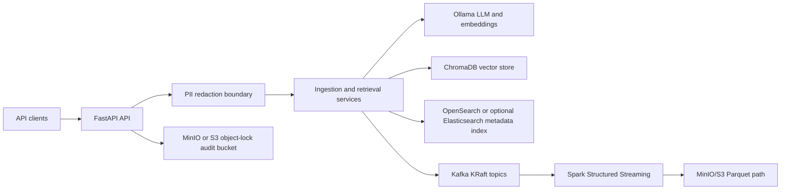

# System context and component architecture

## System context

The platform accepts documents and questions through a FastAPI service. It
sanitizes user-provided text before it reaches chunking, embeddings, retrieval,
or LLM inference. Domain events can be published to Kafka, while Spark
Structured Streaming consumes those events for windowed analytics and Parquet
output. Audit records are written to S3-compatible object storage when the
audit integration is enabled.

## Application components

| Component | Repository location | Responsibility |
| --- | --- | --- |
| HTTP API | `app/main.py` | `/ingest-sample`, `/ask`, health and readiness endpoints |
| PII boundary | `app/redaction.py`, FastAPI middleware | Deterministic tokenization of email, phone, card, and SSN patterns |
| Ingestion context | `contexts/ingestion/` | Sanitized chunk creation and `TelemetryIngested` publication |
| AI context | `contexts/ai/` | Retrieval and optional Ollama generation |
| Governance context | `contexts/governance/` | Optional Kafka event publishing |
| Domain model | `domain/` | Entities, value objects, and immutable integration events |
| Retrieval adapters | `app/storage.py` | ChromaDB/Ollama embeddings, OpenSearch, and in-memory fallback |
| Audit sink | `app/audit.py` | JSON audit records with seven-year COMPLIANCE object retention |
| Metadata adapter | `app/metadata.py` | Optional Elasticsearch index with create-only writes |

The API constructs these components at import time, but external connections
are opt-in through environment variables. This keeps health endpoints and
local tests usable without starting every dependency.

## API boundary

The current public application surface is intentionally small:

- `POST /ingest-sample` accepts `text` and `source`.
- `POST /ask` accepts `question` and bounded `top_k`.
- `GET /healthz` and `GET /readyz` support container probes.

The service does not expose raw PII to the configured vector, search, LLM, or
audit integrations after route-level sanitization.
